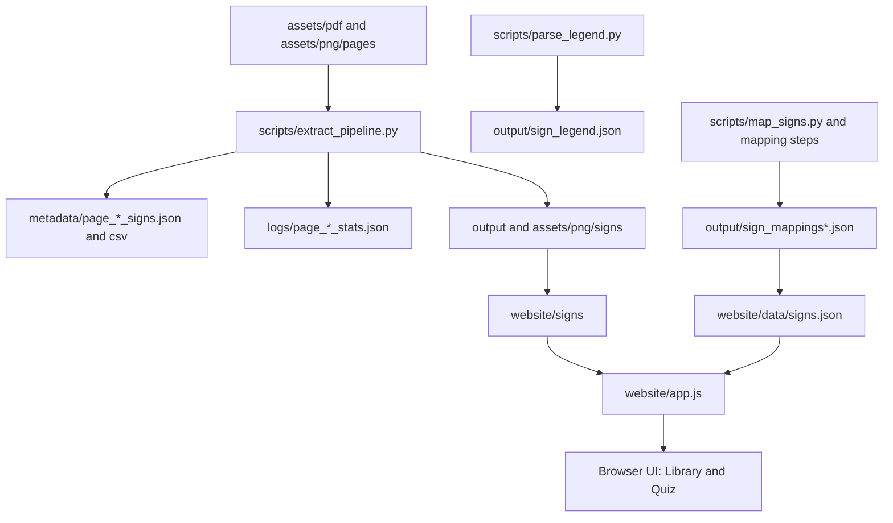

# Project Architecture

Document version: 1.0.0  
Snapshot at (UTC): 2026-07-07T14:15:25Z  
Generated by: GitHub Copilot (GPT-5.3-Codex)

## Architecture Summary

The system is a file-oriented processing architecture:

- Input assets (PDF-derived pages) are analyzed by deterministic extraction scripts.
- Pipeline artifacts are written to output directories as PNG, JSON, and CSV.
- A static website loads an aggregated dataset ([website/data/signs.json](../website/data/signs.json)) and local image files.

No database or API server is required for baseline operation.

## High-Level Components

1. Source Asset Layer
- `assets/pdf/Road Traffic Signs.pdf`
- [assets/png/pages/page_1.png](../assets/png/pages/page_1.png) to [assets/png/pages/page_5.png](../assets/png/pages/page_5.png)
- Layout/config files under `assets/config` and `assets/models/config`

2. Extraction Layer (Python)
- Core orchestrator: [scripts/extract_pipeline.py](../scripts/extract_pipeline.py)
- Supporting scripts: detection, calibration, parsing, mapping
- Grid model modules: [scripts/models/grid_def.py](../scripts/models/grid_def.py), [scripts/models/calibration.py](../scripts/models/calibration.py)

3. Artifact Layer
- Intermediate and final outputs under `output/`, `metadata/`, `logs/`, and `assets/png/verification`
- Website-facing outputs under `website/data` and `website/signs`

4. Presentation Layer (Static Web)
- [website/index.html](../website/index.html)
- [website/app.js](../website/app.js)
- [website/style.css](../website/style.css)
- Runtime host via simple static server

## Component Responsibilities

### [scripts/extract_pipeline.py](../scripts/extract_pipeline.py)

- Performs page-level processing loop.
- Detects candidate sign regions via color + edge methods.
- Merges and filters bounding boxes.
- Applies validation, refinement, confidence scoring.
- Writes crop metadata and stats.
- Emits verification images and contact sheets.

Key data structures:

- `CropMetadata`
- `SignCandidate`
- `ExtractionStats`

### Grid And Calibration Models

[scripts/models/grid_def.py](../scripts/models/grid_def.py):

- Defines `GridRegion` and `PageLayout`.
- Supports computed cell geometry and serialization.

[scripts/models/calibration.py](../scripts/models/calibration.py):

- Defines calibration records and reference points.
- Supports region construction from corner coordinates.

### Website Runtime

[website/app.js](../website/app.js) responsibilities include:

- Loading and normalizing dataset records.
- Search/sort/filter operations.
- Performance-safe card rendering in chunks.
- Lazy image loading with `IntersectionObserver`.
- Quiz subset generation from coded records.

## Data Flow

## Configuration Surfaces

- [assets/config/extraction_config.json](../assets/config/extraction_config.json)
  - Detection thresholds and merge logic
  - OCR toggles and confidence constraints
  - Padding and validation behavior
  - Directory targets for outputs

- [assets/models/config/page_1_layout.json](../assets/models/config/page_1_layout.json)
  - Page dimensions and region geometry for grid-aware workflows

## Architectural Strengths

- Deterministic and reproducible extraction steps.
- Clear artifact outputs for traceability (metadata + logs + visual verification).
- Lightweight deployment for frontend (static files only).

## Architectural Weaknesses

- Multiple output directories can hold overlapping or stale versions.
- No canonical reconciler enforcing one truth source before website publish.
- Quality validation of labels is not a first-class stage.

## Recommended Architecture Hardening

1. Introduce a single canonical publish stage producing immutable release bundles.
2. Add a strict reconciliation script that validates counts and schema before publish.
3. Split exploratory scripts from production scripts by folder and ownership.
4. Add machine-readable manifest per publish with checksums and source references.
