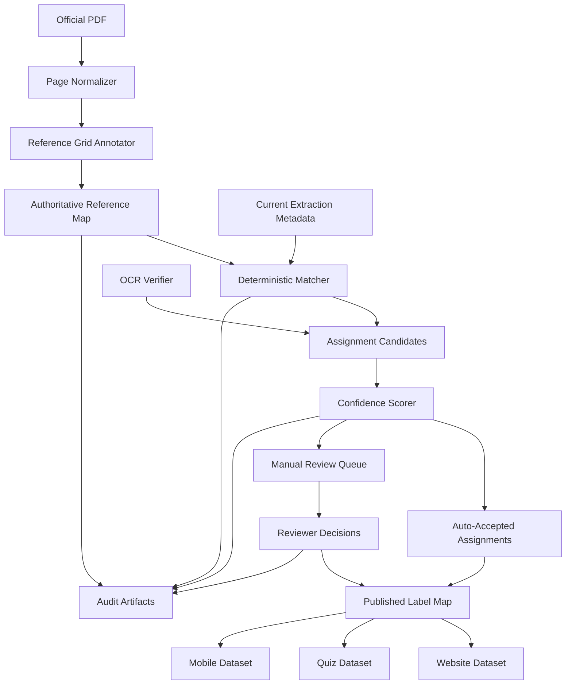
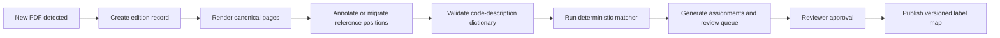

# Reference Map Builder Design

Document version: 1.0.0  
Snapshot at (UTC): 2026-07-07  
Prepared by: GitHub Copilot (GPT-5.3-Codex)

## Purpose

Define a permanent, auditable, deterministic Reference Map Builder that links the official South African road sign manual to extracted sign assets.

This design is implementation-ready architecture only. No label transfer is performed in this phase.

## Design Goals

- Represent every manual page used for sign extraction.
- Represent every authoritative sign position on each page.
- Link each authoritative position to code, description, category, page, grid row and column, extracted image, validation status, and confidence.
- Regenerate deterministically when source PDF editions change.
- Keep OCR strictly as verification, never primary truth.
- Produce complete provenance for every assignment.
- Support website, quiz engine, mobile application, and future manual editions.

## Non-Goals For This Phase

- No automatic label transfer.
- No website label rollout.
- No changes to production mappings.

## High-Level Architecture



## Core Components

### 1. Page Normalizer

Responsibility:

- Register and normalize manual pages to canonical dimensions.
- Generate stable page fingerprints.

Inputs:

- assets/pdf/Road Traffic Signs.pdf

Outputs:

- Canonical page image set
- page_index metadata with dimensions and hashes

### 2. Reference Grid Annotator

Responsibility:

- Define authoritative sign regions for each page.
- Assign row and column coordinates inside page-specific grids.
- Bind each region to official code, description, and category.

Inputs:

- Canonical page images
- Official code-description dictionary from output/sign_legend_clean.json

Outputs:

- Immutable reference positions per page

### 3. Deterministic Matcher

Responsibility:

- Match extracted signs to authoritative reference positions.
- Use geometric criteria as primary key in normalized coordinates.

Inputs:

- metadata/page_1_signs.json through metadata/page_4_signs.json
- Reference map canonical positions

Outputs:

- Candidate assignment set with deterministic scores and tie-break traces

### 4. OCR Verifier

Responsibility:

- Verify existing geometric matches.
- Add corroboration or conflict evidence only.

Rule:

- OCR can only adjust confidence and review priority.
- OCR cannot create primary assignments in isolation.

### 5. Confidence Scorer And Decision Engine

Responsibility:

- Produce assignment confidence score.
- Route assignment to auto-accept or manual review queue.

### 6. Audit Writer

Responsibility:

- Persist full provenance, thresholds, hashes, and decisions for rerun traceability.

## Data Model

### Entity Model

1. Manual Edition
- edition_id
- source_pdf_path
- source_pdf_sha256
- publication_date
- status

2. Manual Page
- edition_id
- page_number
- page_image_width
- page_image_height
- page_image_sha256
- normalized_transform_version

3. Reference Sign Position
- reference_id
- edition_id
- page_number
- category
- grid_row
- grid_col
- norm_x
- norm_y
- norm_w
- norm_h
- official_code
- official_description
- source_region_fingerprint
- reference_status

4. Extracted Sign Instance
- extracted_id
- filename
- page_number
- norm_x
- norm_y
- norm_w
- norm_h
- raw_geometry
- extraction_run_id
- extraction_confidence

5. Assignment Candidate
- assignment_id
- extracted_id
- reference_id
- geometric_iou
- center_distance
- size_ratio
- primary_match_rank
- ambiguity_gap
- ocr_verification_text
- ocr_verification_score
- conflict_flags
- confidence_score
- decision

6. Provenance Record
- provenance_id
- assignment_id
- authoritative_source_type
- authoritative_source_path
- authoritative_source_version
- matching_algorithm_version
- threshold_profile_id
- created_at
- reviewer_id
- reviewer_notes

### Confidence Model

Proposed confidence components:

- Geometry score, 0.70 weight
- Ambiguity penalty, 0.15 weight
- OCR verification consistency, 0.10 weight
- Extraction quality score, 0.05 weight

Decision thresholds:

- Auto accept: confidence greater than or equal to 0.93 and no conflict flags
- Manual review: confidence less than 0.93 or any conflict flag

## File Formats

## 1. Manual edition index

Path proposal:

- metadata/reference_map/manual_editions.json

Schema sketch:

```json
[
  {
    "edition_id": "za-rtl-2026-01",
    "source_pdf_path": "assets/pdf/Road Traffic Signs.pdf",
    "source_pdf_sha256": "...",
    "publication_date": "2026-01-01",
    "status": "active"
  }
]
```

## 2. Page index

Path proposal:

- metadata/reference_map/pages.json

Schema sketch:

```json
[
  {
    "edition_id": "za-rtl-2026-01",
    "page_number": 1,
    "image_width": 6736,
    "image_height": 9536,
    "page_image_sha256": "...",
    "normalized_transform_version": "v1"
  }
]
```

## 3. Authoritative reference positions

Path proposal:

- metadata/reference_map/reference_positions.json

Schema sketch:

```json
[
  {
    "reference_id": "za-rtl-2026-01-p1-r03-c12",
    "edition_id": "za-rtl-2026-01",
    "page_number": 1,
    "category": "regulatory",
    "grid_row": 3,
    "grid_col": 12,
    "norm_x": 0.4123,
    "norm_y": 0.2874,
    "norm_w": 0.0411,
    "norm_h": 0.0579,
    "official_code": "R210",
    "official_description": "No overtaking",
    "source_region_fingerprint": "...",
    "reference_status": "verified"
  }
]
```

## 4. Deterministic match output

Path proposal:

- metadata/reference_map/assignments.json

Schema sketch:

```json
[
  {
    "assignment_id": "assign-000001",
    "extracted_filename": "page1_unknown_057.png",
    "page_number": 1,
    "reference_id": "za-rtl-2026-01-p1-r03-c12",
    "official_code": "R210",
    "official_description": "No overtaking",
    "category": "regulatory",
    "grid_row": 3,
    "grid_col": 12,
    "validation_status": "auto",
    "confidence": 0.96,
    "geometry": {
      "iou": 0.94,
      "center_distance": 0.008,
      "size_ratio": 1.03
    },
    "ocr_verification": {
      "enabled": true,
      "text": "R210",
      "score": 0.81,
      "consistent": true
    },
    "provenance": {
      "source_type": "reference_positions",
      "source_path": "metadata/reference_map/reference_positions.json",
      "algorithm_version": "rmb-v1",
      "threshold_profile": "strict-v1"
    }
  }
]
```

## 5. Manual review queue

Path proposal:

- metadata/reference_map/manual_review_queue.json

Contains only unresolved or low-confidence assignments with ranked alternatives.

## 6. Audit manifest

Path proposal:

- logs/reference_map_run_manifest.json

Contains full run context:

- source hashes
- config versions
- thresholds
- counts
- deterministic checksum of outputs

## Deterministic Regeneration Strategy

When PDF is updated:

1. Register new edition_id using PDF hash.
2. Re-render canonical page images with fixed DPI and renderer settings.
3. Recompute normalized transforms and page hashes.
4. Rebuild reference_positions for the new edition.
5. Run deterministic matcher with locked thresholds.
6. Compare output checksum with prior run for same edition.
7. If mismatch occurs, fail gate and require review.

Determinism controls:

- Stable sort orders on page, y, x, filename.
- Fixed float rounding precision for normalized coordinates.
- Versioned threshold profiles.
- Fixed timestamp mode for reproducibility checks.

## Update Workflow



Operational steps:

- Step 1: Edition registration
- Step 2: Page canonicalization
- Step 3: Reference map generation
- Step 4: Assignment run
- Step 5: Manual review completion
- Step 6: Publish and lock manifest

## Verification Workflow

Verification layers:

1. Schema validation
- Validate all reference and assignment JSON files.

2. Coverage validation
- Every extracted sign must have one and only one final assignment.

3. Provenance validation
- Every assignment must point to authoritative source path and version.

4. Confidence validation
- Every automatic assignment must include confidence.
- Every low-confidence assignment must exist in manual review queue.

5. Determinism validation
- Re-run on same inputs and verify byte-stable outputs or documented expected differences.

6. OCR consistency validation
- OCR disagreement does not overwrite primary mapping.
- OCR disagreement raises review priority.

## Integration With Extraction Pipeline

Current integration points:

- Extraction outputs: metadata/page_*.json
- Current dataset output: website/data/signs.json

Planned integration:

1. Extraction pipeline remains responsible for geometry and image crop generation.
2. Reference Map Builder consumes extraction metadata and authoritative map.
3. Label assignment output is written as a separate artifact, not embedded directly in extraction stage.
4. Publish step merges geometry with approved labels into final platform datasets.

Proposed stage ordering:

- Stage A: Extract geometry and assets
- Stage B: Build or load authoritative reference map
- Stage C: Deterministic assignment and review routing
- Stage D: Publish labeled dataset

## Integration With Website And Quiz

Website requirements:

- Consume published assignments with code, description, category, confidence, validation_status, provenance summary.
- Support filters:
  - auto accepted
  - manually verified
  - pending review

Quiz requirements:

- Include only validated assignments by policy.
- Optionally include confidence threshold for training mode.

Proposed publish files:

- website/data/signs.json, full library
- website/data/signs_quiz_ready.json, validated subset only

## Scalability For Future Manual Editions

Scalability approach:

- Edition-based versioning, no destructive overwrite.
- Parallel support for multiple manual editions.
- Cross-edition mapping table for code migrations and deprecated signs.
- Category extensions without schema breakage.

Future capabilities:

- Multi-language description overlays.
- Region-specific sign variants.
- API export bundles for mobile clients.

## Security And Governance

Governance rules:

- Authoritative reference files are write-protected after approval.
- Assignment runs are immutable and signed by run manifest hash.
- Manual review changes require reviewer identity and reason.

## Acceptance Criteria For Reference Map Builder Design Approval

This design is approved when reviewers agree that it guarantees:

- 100 percent image coverage for extracted signs.
- 100 percent authoritative code and description coverage after review completion.
- Full provenance for each label.
- Confidence for every automatic assignment.
- Mandatory queueing of low-confidence assignments.
- Deterministic rerun reproducibility from source PDF to published artifacts.

## Recommended Next Step After Design Review

Implement in three controlled milestones:

1. Reference map schema and edition registry.
2. Deterministic geometric matcher with audit output.
3. Review queue and publish integration for website and quiz.
